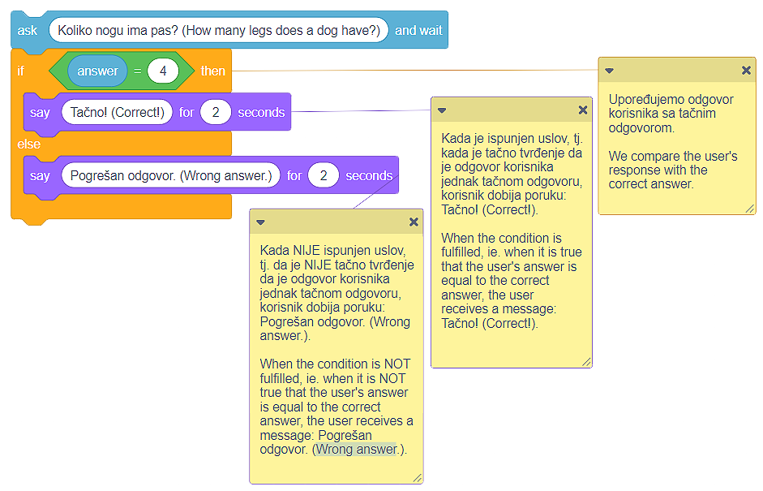

Grananje
========

.. |If| image:: ../_images/grananje/If.png
.. |IfElse| image:: ../_images/grananje/IfElse.png
.. |And| image:: ../_images/grananje/And.png
.. |Or| image:: ../_images/grananje/Or.png
.. |Not| image:: ../_images/grananje/Not.png

Pomenuli smo da je ponavljanje jedne ili više naredbi (blokova) moćan kocept u programiranju. 

Jednako koristan i važan je **koncept grananja programa**. Grananje omogućava da se deo naredbi programa izvši, a deo ne. Koje naredbe će biti izvršene zavisi od ispunjenosti **uslova**. Uslov treba da shvatiš kao tvrđenje koje može biti **tačno** ili **netačno**.

Iako smo do sada stvarali samo programe u kojima su se sve naredbe izvršavale redom, jedna za drugom, od početka do kraja programa, većina programa sadrži grananje.

U kategoriji **Upravljanje (Control)** nalaze se dva bloka namenjena grananju:

•	Blok koji obezbeđuje da se izvrše određene naredbe ako je rezultat provere ispunjenosti uslova **tačno** |If| i 
•	Blok koji obezbeđuje da se izvrše određene naredbe ako je rezultat provere ispunjenosti uslova **tačno**, a druge naredbe ako je rezultat provere ispunjenosti uslova **netačno** |IfElse|.

.. |VeceOd| image:: ../_images/grananje/VeceOd.png
.. |Jednako| image:: ../_images/grananje/Jednako.png
.. |ManjeOd| image:: ../_images/grananje/ManjeOd.png

Jedan od načina da utvrdimo da li je uslov ispunjen jeste da, iz kategorije **Operatori (Operators)** odaberemo neki od **operatora poređenja**:

•	veće od |VeceOd|; 
•	manje od |ManjeOd|;
•	jednako |Jednako|.

.. mchoice:: GrananjeZ1
   :answer_a: Kako rezulzat izvršavanja skripte A, program će ispisati rečenicu "Kupiću sladoled! (I'll buy icecream!)".
   :answer_b: Izvršavanjem skripti A i B dobiće se isti rezultat - programi će ispisati rečenicu "Kupiću sladoled! (I'll buy icecream!)".
   :answer_c: Kao rezultat izvršavanja skripte B, program će ispisati rečenicu "Kupiću sladoled! (I'll buy icecream!)".  
   :feedback_a: Pažljivo pogledaj operator poređenja skripte A. Verujemo da uočavaš da će program ispisati rečenicu "Kupiću sladoled! (I'll buy icecream!)" samo ako je cena sladoleda manja od 100 novčića.     
   :feedback_b: Analiziraj kako je definisan operator poređenja u skripti A, a kako u skripti B. Verujemo da uočavaš da će izvršavanjem skripte A rečenica "Kupiću sladoled! (I'll buy icecream!)" biti ispisana samo ako je cena sladoleda manja od 100 novčića. Izvršavanjem skripte B, rečenica "Kupiću sladoled! (I'll buy icecream!)" biće ispisana ako je cena sladoleda manja ili jednaka 100 novčića.
   :feedback_c: Imaš odlično zapažanje! Program će ispisati rečenicu "Kupiću sladoled! (I'll buy icecream!)" ako je njegova cena manja ili jednaka 100 dinara.
   :correct: c

   Cena sladoleda je 100 novčića. Analiziraj skripte date na slici i označi tačno tvrđenje.

   .. image:: ../_images/grananje/Sladoled.png
      :align: center

Koncept grananja programa najlakše je razumeti na primeru izrade programa koji simulira kviz. Kada korisniku postavimo pitanje i sačekamo njegov odgovor, prirodno je da mu uputimo povratnu informaciju da li je njegov odgovor tačan ili nije. Informaciju o tačnosti odgovora možemo da pružimo samo kada utvrdimo da li je odgovor korisnika identičan tačnom odgovoru. 

Iako deluje da smo kod napisali korektno i da tačan odgovor na pitanje Koliko nogu ima pas? jeste 4, korisnik je mogao da odgovori na pitanje ispisujući string umesto broja. Drugim rečima, tačan odgovor na postavljeno pitanje nije samo 4, već je i:

•	četiri; 
•	cetiri;
•	four.

Očigledno je da uslov moramo da definišemo pažljivije, tj. da uvažimo sve moguće tačne odgovore.

Ovu situaciju prevazilazimo korišćenjem **logičkih operatora**, koje pronalazimo u kategoriji **Operatori (Operators)**:

•	i |And|; 
•	ili |Or|;
•	nije |Not|.

U našem slučaju, tačan odgovor može da bude **4 ili četiri ili cetiri ili four**. Zato ćemo, za definisanje uslova da upotrebimo operator |Or| više puta. 

.. image:: ../_images/grananje/Uslov.png
   :align: center

Kod koji uvažava sve oblike tačnog odgovora izgleda ovako:

.. image:: ../_images/grananje/Kviz2.png
   :align: center

.. |Uradi| image:: ../_images/Uradi.png

|Uradi| Deca su navikla da koriste uređaje sa ekranima osetljivim na dodir. Nisu naročito spretna kada je korišćenje miša u pitanju. Pomoći ćemo im da uvežbaju ovu tehniku tako što ćemo da napravimo program u kome je lik Kamion, a pozadina pozornice Put. Kamion treba da prati pokazivač miša korisnika i stigne sa leve na desnu stranu pozornice. Na svom putu, kamion ne sme da dodirne ivicu puta. Ako do takvog dodira dođe, kamion se vraća na početnu poziciju (na početak puta na levoj strani pozornice - **x: -226**, **y: -41**). Pri kreiranju programa predlažemo ti da koristiš projekat *Putovanje* na adresi |https://scratch.mit.edu/projects/326419371/|.

.. |https://scratch.mit.edu/projects/326419371/| raw:: html

 <a href="https://scratch.mit.edu/projects/326419371/" target="_blank">https://scratch.mit.edu/projects/326419371/</a>

.. image:: ../_images/grananje/Putovanje.png
   :align: center

Kao što vidiš, lik Kamion je suviše veliki za uzak put nacrtan na pozadini pozornice koju koristimo u ovom programu. Takođe, uočavaš da je put bele boje i da ga od "trave" odvaja crna linija. Ova dva zapažanja treba da ti budu na umu ako želiš samostalno da napraviš ovakav program.

.. reveal:: sakrivanjeGrananje1
   :showtitle: Pogledaj jedno od mogućih rešenja
   :hidetitle: Sakrij rešenje
 
   **Moguće rešenje**
     
   .. image:: ../_images/grananje/Putovanje1.png 
	:align: center

.. |Izazov| image:: ../_images/Izazov.png

|Izazov| Bilo bi dobro da naš program meri vreme potrebno da korisnik "dovede" kamion do kraja puta. Unapredi program dodajući mu skriptu koja meri vreme potrebno korisniku da "završi putovanje".

.. reveal:: sakrivanjeGrananje2
   :showtitle: Pogledaj jedno od mogućih rešenja
   :hidetitle: Sakrij rešenje
 
   **Moguće rešenje**
     
   .. image:: ../_images/grananje/Putovanje2.png 
	:align: center

|Izazov| Koristeći koncepte i tehnike prikazane u ovoj i prethodnim lekcijama, napravi program koji simulira unos lozinke pri radu na računaru. Neka program nudi korisniku da unese lozinku tri puta. Ako ne uspe da unese tačnu lozinku, program prestaje sa radom. Ako uspe, menja se kostim lika. Predlažemo ti da koristiš projekat na adresi |https://scratch.mit.edu/projects/326403173/|, gde smo postavili lik Laptop koji ima 2 kostima. Srećno!  

.. |https://scratch.mit.edu/projects/326403173/| raw:: html

 <a href="https://scratch.mit.edu/projects/326403173/" target="_blank">https://scratch.mit.edu/projects/326403173/</a>

.. reveal:: sakrivanjePonavljanje1
   :showtitle: Pogledaj naše rešenje
   :hidetitle: Sakrij rešenje
 
   **Moguće rešenje**
     
   Naše rešenje naći ćeš u projektu **Lozinka rešenje**, na adresi |https://scratch.mit.edu/projects/326417414/|. Predlažemo ti da remiksuješ projekat i, koristeći komentare, objasniš naše rešenje. Znamo da možeš!

.. |https://scratch.mit.edu/projects/326417414/| raw:: html

 <a href="https://scratch.mit.edu/projects/326417414/" target="_blank">https://scratch.mit.edu/projects/326417414/</a>