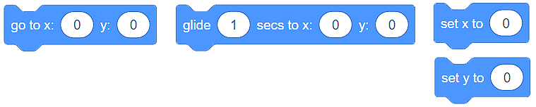
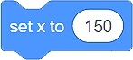

Kretanje
========

Već poznaješ radno okruženje Skreča, umeš da kreiraš likove i odrediš njihov položaj na pozornici. Pravi je trenutak da naučiš da ih pokrećeš koristeći naredbe (blokove) iz kategorije **Kretanje (Move)**. Upotrebljavajući ove blokove bićeš u situaciji da napraviš jednostavne igrice i animacije.

Razlikujemo tri vrste blokova namenjenih kretanju likova:

•	Blokove za apsolutno kretanje
•	Blokove za relativno kretanje
•	Ostale blokove za kretanje

Blokovi za apsolutno kretanje
-----------------------------

U kategoriji **Kretanje (Move)**, na raspolaganju imaš 4 bloka koja omogućavaju apsolutno kretanje likova. 

Upotrebljavaćeš ih u situacijama kada bude potrebno da programiraš likove tako da se kreću do **tačno određenog mesta (tačke) na pozornici**.

.. infonote::

    **Pojurila mačka miša...**
        
    Mačka se nalazi u centru pozornice, a miš u tački **(x:150 y:100)**. 

    .. image:: ../_images/kretanje/MM1.png 
       :width: 400px
       :align: center

    
    Podsećamo te da je pozornica pravougaoni prostor širine 480 i visine 360 koraka (piksela). Centar pozornice nalazi se u tački **(x:0 y:0)**.

.. |AK1| image:: ../_images/kretanje/AK1.png
.. |AK2| image:: ../_images/kretanje/AK2.png

.. |AK4| image:: ../_images/kretanje/AK4.png

Ako želiš da mačka ulovi miša dovoljno je upotrebiš blok |AK1|.

.. image:: ../_images/kretanje/MM1a.png 
   :width: 400px   
   :align: center

Ako želiš da lov traje, upotrebi blok |AK2|. Time obezbeđuješ da mačka klizi jednu sekundu od tačke **(x:0 y:0)** do tačke **(x:150 y:100)**.

Upotrebom blokova |AK3| i |AK4| možeš da simuliraš prikradanje mačke mišu:

.. image:: ../_images/kretanje/MM34a.png  
   :width: 800
   :align: center

Tačku u kojoj se lik trenutno nalazi (trenutnu vrednost **x:** i **y:**) uvek možeš da vidiš ispod pozornice, u okviru liste likova.

.. image:: ../_images/kretanje/XY.png  
   :align: center

.. mchoice:: AKZadatak1
   :answer_a: Program A
   :answer_b: Program B
   :feedback_a: Bravo! Mačka je "uhvatila" sve miševe!    
   :feedback_b: Hm.. Savetujemo ti da proučiš lekciju Položaj lika na pozornici.
   :correct: a

   Analiziraj položaj miševa na slici i označi program koji će omogućiti mački da "ulovi" sve miševe.

   .. image:: ../_images/kretanje/AKZ1.png
      :width: 700
      :align: center

.. |Vazno| image:: ../_images/Vazno.png

.. infonote::

    |Vazno|   **Dakle, upotrebom blokova za apsolutno kretanje saopštavaš liku tačno mesto na pozornici na koje treba da stigne.**

Blokovi za relativno kretanje
-----------------------------

.. |RKS2| image:: ../_images/kretanje/RKS2.png

Relativno kretanje nije određeno mestom u koje lik treba da stigne, već trenutnim položajem lika.

U kategoriji **Кretanje**, na raspolaganju imaš nekoliko blokova koja omogućavaju relativno kretanje.

.. image:: ../_images/kretanje/RKBlokovi.png  
   :align: center

U primeru u kome je mačka jurila miša znali smo tačan položaj miša (tačku u kojoj se nalazi). Mnogo su češće situacije u kojima ne znamo tačan položaj likova. U tim slučajevima likove pokrećemo korišćenjem blokova za relativno kretanje.

Кod relativnog kretanja jako je važno da usmerimo (okrenemo) lik u stranu u koju želimo da se kreće. To postižemo povlačenjem strelice po krugu bloka |RKS2|. 

Добро је да знаш да у Скречу усмерење ка 0 представља усмерење нагоре, ка 90 удесно, ка 180 надоле, а ка -90 улево.

.. image:: ../_images/kretanje/RKS1.png  
   :width: 800
   :align: center

Trenutno usmerenje lika uvek možeš da vidiš ispod pozornice, u okviru liste likova, u polju **Smer**.

.. image:: ../_images/kretanje/XY.png 
   :align: center

.. mchoice:: RKZadatak1
   :answer_a: Смер: 90 (desno) Položaj: (x:50 y:-100)
   :answer_b: Smer: 180 (dole) Položaj: (x:50 y:100)
   :feedback_a: Analiziraj program ponovo. Da li okretanje za 90 stepeni menja usmerenje lika?    
   :feedback_b: Bravo! Dobro uočavaš kretanje lika!
   :correct: b

   Analiziraj program na slici i označi usmerenje lika, kao i njegov položaj nakon izvršavanja programa.

   .. image:: ../_images/kretanje/RKZ1.png
      :align: center

.. infonote::

    |Vazno|   **Dakle, upotrebom blokova za relativno kretanje saopštavaš liku gde treba da se usmeri i kreće u odnosu na njegov trenutni položaj.**

Ostali blokovi za kretanje
--------------------------

U kategoriji **Кretanje**, na raspolaganju imaš još 4 bloka koja omogućavaju kretanje likova. 

.. image:: ../_images/kretanje/OKBlokovi.png   
   :align: center

.. |OK3| image:: ../_images/kretanje/OK3.png
.. |OK4a| image:: ../_images/kretanje/OK4a.png
.. |OK4b| image:: ../_images/kretanje/OK4b.png

Pozornica je ograničen prostor. Кada lik stigne do ivice (kaže se i ruba) pozornice, prirodno je da se okrene i nastavni kretanje u drugom pravcu ili smeru. Takvo ponašanje lika obezbeđuješ korišćenjem bloka |OK3|. Način na koji će lik nastaviti kretanje zavisi od tebe. Ako, u okviru bloka |OK4a| podesiš da se lik okreće na **sve strane**, on će nastavniti kretanje okrenut naglavačke. Ovo se neće dogoditi ako iz padajuće liste bloka odabereš levo-desno |OK4b|.

.. image:: ../_images/kretanje/OKRub12.png
   :width: 800
   :align: center

Trenutni način kretanja lika uvek možeš da vidiš ispod pozornice, u okviru liste likova, u polju **Smer (Direction)**.

.. image:: ../_images/kretanje/XY.png
   :width: 400px   
   :align: center

Vratimo se na naše likove: |macka| i |mis|. 

.. |OK1| image:: ../_images/kretanje/OK1.png
.. |OK1a| image:: ../_images/kretanje/OK1a.png
.. |macka| image:: ../_images/kretanje/macka.png
.. |mis| image:: ../_images/kretanje/mis.png

Ako ne znamo tačan položaj miša, a želimo da mačka bude usmerena na njega (okrenuta ka njemu), možemo da upotrebimo blok |OK1|. Dovoljno je da iz padajuće liste odaberemo lik Miš |OK1a| i problem je rešen.

Pokazaćemo ti na primeru kako funkcionišu poslednja dva bloka.

.. infonote::

    **Pojurila mačka miša...**
        
    Mačka juri miša, klizeći ka njemu. Miš se neprestano okreće i ide ka kursoru, koji mi pomeramo po pozornici.

    .. image:: ../_images/kretanje/OKPR1.png   
       :align: center

    
    Iznad svakog od likova nalaze se skripte koje obezbeđuju opisano ponašanje. 

.. |Izazov| image:: ../_images/Izazov.png

|Izazov| Unapredi gornji program tako što ćeš dodati još jedan lik - jabuku. Neka miš juri jabuku, a mačka miša. Neka se jabuka kreće ka kursoru (kojim mi upravljamo), miš prema jabuci, mačka prema mišu.

.. image:: ../_images/kretanje/MMJ.png  
   :width: 400
   :align: center

.. reveal:: sakrivanjeKretanje
   :showtitle: Uporedi rešenje sa našim
   :hidetitle: Sakrij rešenje
 
   **Moguće rešenje:**
     
   .. youtube:: QgCCzBw6DKU
      :width: 735
      :height: 415
      :align: center
   
   
