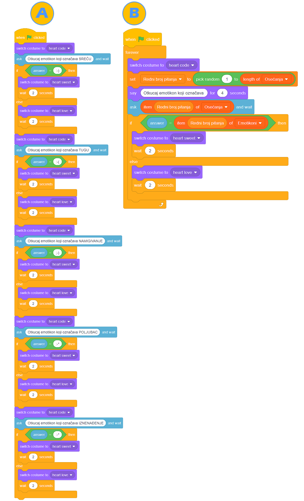

Liste
-----

.. |AnswerMima| image:: ../_images/promenljive/AnswerMima.png
.. |VAnswer| image:: ../_images/promenljive/VAnswer.png
.. |AnswerMi| image:: ../_images/promenljive/AnswerMi.png
.. |MakeList| image:: ../_images/liste/MakeList.png
.. |Emotikoni| image:: ../_images/liste/Emotikoni.png
.. |Uradi| image:: ../_images/Uradi.png

.. mchoice:: ListeZadatak1
   :answer_a: U promenljivoj se sačuva više podataka (brojeva, stringova, vrednosti Tačno ili Netačno)
   :answer_b: U promenljivoj se sačuva samo jedan podatak (broj, string, vrednost Tačno ili Netačno)
   :correct: b
   :feedback_a: Razmisli o svom odgovoru. Ako ostaneš pri svom mišljenju, napravi ove programe u Skreču i izvrši ih. Ne zaboravi da označiš da vrednosti promenljivih budu vidljive na pozornici.
   :feedback_b: Odlično zapažaš, bravo! Iako su različiti, programi imaju isti rezultat izvršavanja. 

   Napravili smo promenljivu |VAnswer|. U jednom trenutku, vrednost ove promenljive je |AnswerMima|. U drugom trenutku, njena vrednost je |AnswerMi|. Označi tačno tvrđenje:

Kreiranje programa često pred programera stavlja potrebu da sačuva veći broj podataka (telefonskih brojeva, naziva proizvoda, adresa...). U tim situacijama, promenljive koje smo do sada koristili nisu od velike pomoći.

Zbog ovakvih situacija, koje ćeš sigurno imati u svom budućem programerskom radu, predstavljamo ti **Listu (List)**.

Lista predstavlja kolekciju podataka. Možeš da je posmatraš kao "svesku" u kojoj se nalazi veliki broj "stranica". Svaka od "stranica" numerisana je brojem (od 1 nadalje) i na svakoj od "kutija" zapisan je (čuva se) po jedan podatak. 

Listu kreiramo u kategoriji **Promenljive (Variables)**, klikom na dugme |MakeList|. Lista može da se odnosi na samo jedan ili na sve likove u programu. Elemente liste unosimo pritiskom na znak **+** i upisivanjem vrednosti u odgovarajući prostor.

.. image:: ../_images/liste/NewList.png  
   :align: center
   
Za razliku od *običnih* promenljivih koje pozivamo navođenjem njihovog imena, podacima smeštenim u listu "obraćamo" se navodeći njihov redni broj (položaj) u listi.

Lista |Emotikoni| sadrži 5 podataka - tekstualnih oznaka za određene izraze lica. Ako želimo da maca kaže kako se tekstualno notira NAMIGIVANJE, treba da složimo skriptu sledećeg izgleda:

.. image:: ../_images/liste/KodEmo.png   
   :align: center

Napravili smo isti kviz pomoću *običnih* promenljivih i pomoću listi. Analiziraj njihove skripte:

|Uradi| Remiksuj programe A i B, koji se nalaze na adresama A: |https://scratch.mit.edu/projects/326482978/| i B: |https://scratch.mit.edu/projects/326477714/| tako što ćeš dodati bar još tri pitanja vezana za osećanja i emotikone koji ih predstavljaju. Ne sumnjamo da ćeš uočiti koliko vremena štedimo upotrebom listi umesto promenljivih.

.. |https://scratch.mit.edu/projects/326482978/| raw:: html

 <a href="https://scratch.mit.edu/projects/326482978/" target="_blank">https://scratch.mit.edu/projects/326482978/</a>

.. |https://scratch.mit.edu/projects/326477714/| raw:: html

 <a href="https://scratch.mit.edu/projects/326477714/" target="_blank">https://scratch.mit.edu/projects/326477714/</a>

