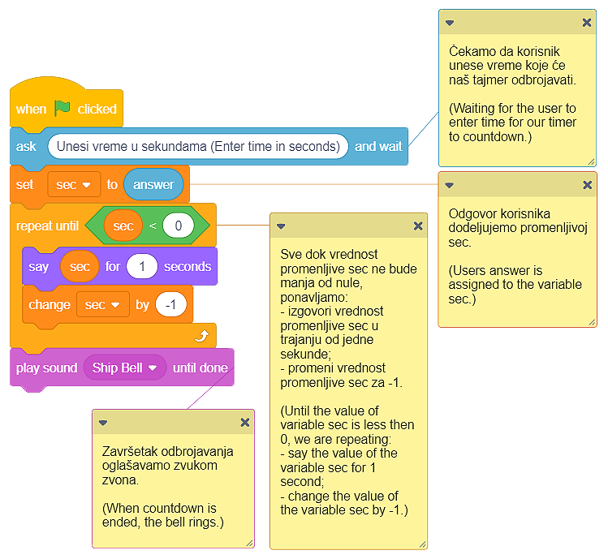

Ponavljanje
===========

Već smo pomenuli da je ponavljanje jedne ili više naredbi (blokova) moćan kocept u programiranju. Kada se neke naredbe programa izvršavaju više puta kažemo da program sadrži **ponavljanja (cikluse)**. Do sada smo, već nekoliko puta, koristili ovaj koncept.

.. |Repeat10| image:: ../_images/ponavljanje/Repeat10.png
.. |RepeatF| image:: ../_images/ponavljanje/RepeatF.png
.. |RepeatU| image:: ../_images/ponavljanje/RepeatU.png

U Skreču, na raspolaganju imamo 3 vrste blokova za ponavljanje naredbi:

•	Blok koji ponavlja naredbe tačno određeni broj puta; 
•	Blok koji ponavlja naredbe beskonačan broj puta;
•	Blok koji ponavlja naredbe sve dok ne bude ispunjen određeni uslov.

U njih se umeću blokovi čije izvršavanje treba da se ponovi.

Blok koji ponavlja naredbe tačno određeni broj puta
---------------------------------------------------

.. |Uradi| image:: ../_images/Uradi.png

.. |Repeat5| image:: ../_images/ponavljanje/Repeat5.png

.. image:: ../_images/ponavljanje/Repeat10.png
   :align: center

Blok koji ponavlja naredbe tačno određeni broj puta upotrebili smo u programu *Farma* (detaljnije u lekciji Izgled).  

Naše pile simuliralo je pokrete kljucanja tako što je 10 puta smenjivalo kostime a, b i c. Nakon ove simulacije, pile je uvećavalo veličinu za 10. Namera nam je bila da se pile uveća za 50, pa smo 5 puta ponovili uvećanje za 10. Da bismo postigli opisano ponašanje, koristili smo blokove |Repeat10a| i |Repeat5|.

Na donjoj slici umanjili smo deo skripte koji se odnosi na ponavljanje naredbi i napravili isti program bez upotrebe blokova za ponavljanje. Skripta je zaista dugačka, pa smo, radi preglednosti, morali da je podelimo u pet stubaca.

.. image:: ../_images/ponavljanje/PileBezRepeat.png
   :width: 1200px   
   :align: center

|Uradi| Napravi i ti program *Farma* bez korišćenja blokova za ponavljanje. Uporedi kod sa našim. Verujemo da uočavaš da nizanje identičnih grupa blokova čini program dužim, težim za razumevanje i nadograđivanje.

Blok koji ponavlja naredbe beskonačan broj puta
-----------------------------------------------

.. |StopAll| image:: ../_images/ponavljanje/StopAll.png
.. |StopTS| image:: ../_images/ponavljanje/StopTS.png
.. |StopOS| image:: ../_images/ponavljanje/StopOS.png

.. image:: ../_images/ponavljanje/RepeatF.png
   :align: center

Ovaj blok za ponavljanje naredbi izvršava se beskonačan broj puta. Njegovo izvršavanje nikada se ne prekida samostalno. Prekidamo ga klikom na dugme za prestanak rada programa (crveno dugme pored zelene zastavice) ili korišćenjem jednog od blokova |StopAll| / |StopTS| / |StopOS|, iz kategotije **Upravljanje (Control)**.

Blok koji ponavlja naredbe beskonačan broj puta koristili smo u programu *Ide maca oko tebe* (detaljnije u lekciji Kretanje).

.. mchoice:: PonavljanjeZ1
   :answer_a: U sam blok se mogu dodati novi blokovi, pa nema potrebe da se skripta nastavlja.
   :answer_b: U pitanju je greška u Skreču. Blok za beskonačno ponavljanje naredbi morao bi da ima mogućnost nastavka ređenja skripti. 
   :answer_c: Dalje dodavanje blokova je besmisleno zato što oni nikada ne bi bili izvršeni.  
   :feedback_a: Mogućnost dodavanja novih blokova u sam blok |RepeatF| ne pruža mogućnost nizanja skripti koje se neće ponavljati, već samo dodaje naredbe koje će se beskonačno puta izvršavati.    
   :feedback_b: Koliko je verovatno da je jedan od najčešće korišćenih blokova u Skreču pogrešno koncipiran? Predlažemo ti da još jednom razmisliš o pitanju i daš novi odgovor. 
   :feedback_c: Odlično zaključuješ, bravo!  
   :correct: c

   Analiziraj izgled blokova za ponavljanje naredbi. Uočljivo je da blok za beskonačno ponavljanje nema mogućnost povezivanja sa drugim blokovima, na njega se ne može dodati nijedan blok. Zašto?

Blok koji ponavlja naredbe sve dok ne bude ispunjen određeni uslov
------------------------------------------------------------------

.. |VSec| image:: ../_images/ponavljanje/Vsec.png

.. image:: ../_images/ponavljanje/RepeatU.png
   :align: center

Ovaj blok za ponavljanje naredbi izvršava se sve dok ne bude ispunjen određeni uslov. Skripte unutar ovog bloka izvršavaju se na osnovu ispitivanja tačnosti uslova koji se u blok postavlja. Ovaj blok koristimo kada ne znamo koliko je puta potrebno izvršiti naredbe unutar bloka za ponavljanje i zato želimo da se one izvršavaju sve dok ne bude ispunjen određeni uslov.

.. mchoice:: PonavljanjeZ2
   :answer_a: Blok koji ponavlja naredbe tačno određeni broj puta.
   :answer_b: Blok koji ponavlja naredbe beskonačan broj puta. 
   :answer_c: Blok koji ponavlja naredbe sve dok ne bude ispunjen određeni uslov.  
   :feedback_a: Ako odabereš ovaj blok, ispaljivanje raketa nema nikakve veze sa nivoom energije tvog lika, zar ne?    
   :feedback_b: Ako odabereš ovaj blok, ispaljivanje raketa nema nikakve veze sa nivoom energije tvog lika, zar ne? 
   :feedback_c: U pravu si! Broj ponavljanja zavisi od ispunjenosti uslova. Onog trenutka kada nivo energije tvog lika padne ispod određene vrednosti, ispaljivanje raketa biće zaustavljeno.  
   :correct: c

   Želiš da napraviš program u kome tvoj lik (protivgradni top) ispaljuje rakete na gradonosne oblake sve dok mu nivo energije ne padne ispod određene vrednosti. Koji blok za ponavljanje naredbi ćeš koristiti?

Demonstriraćemo način na koji *blok koji ponavlja naredbe sve dok ne bude ispunjen određeni uslov* funkcioniše - napravićemo program koji simulira tajmer, tj. odbrojava sekunde od unete vrednosti do nule.

Za potrebe ovog programa definisaćemo promenljivu |VSec| koja će čuvati vrednost preostalih sekundi tokom odbrojavanja tajmera. Od korisnika ćemo tražiti da unese broj sekundi. Pokrenućemo odbrojavanje. Nakon isteka unetog vremena oglasiće se zvučni signal.

Na donjoj slici je naš predlog koda programa sa komentarima koji ga pojašnjavaju. Programeri smatraju da je korisno komentarisati skripte i objasniti šta određeni blokovi rade. Кomentarisanjem olakšavamo drugim programerima da razumeju programe koje stvaramo, kao i da ih nadograđuju. Кomentar dodaješ desnim klikom na skriptu i odabirom opcije **Dodaj komentar (Add comment)**.

|Uradi| Program *Tajmer* nalazi se na adresi |https://scratch.mit.edu/projects/326420353|. Unapredi ga tako što ćeš dodati zvuk otkucavanja sata dok tajmer odbrojava sekunde.

.. |https://scratch.mit.edu/projects/326420353| raw:: html

 <a href="https://scratch.mit.edu/projects/326420353" target="_blank">https://scratch.mit.edu/projects/326420353</a>