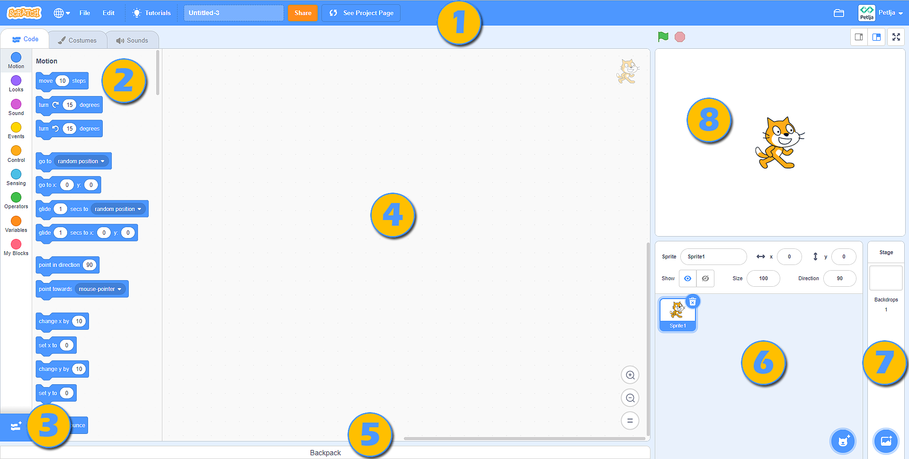

Vizuelni programski jezik Skreč 
===============================

Skreč je vizuelni programski jezik napravljen za decu. Programiranje u Skreču ne zahteva pisanje naredbi. Za izradu programa, dovoljno je da, u odgovarajućem redosledu složimo **blokove** (slično kao pazle ili kockice). 

Rezultat izvršavanja programa koji sadrži samo naredbu |BWelcome| izgleda ovako: |Welcome|.
  .. |BWelcome| image:: ../_images/scratch/BWelcome.png
  .. |Welcome| image:: ../_images/scratch/Welcome.png

Skreč (verziju 3) možemo da ga koristimo na dva načina:

•	preuzimanjem instalacione datoteke sa adrese |https://scratch.mit.edu/download| i instaliranjem na lični digitalni uređaj (desktop verzija programa);
•	na adresi |https://scratch.mit.edu| (onlajn verzija programa).

.. |https://scratch.mit.edu/download| raw:: html

 <a href="https://scratch.mit.edu/download" target="_blank">https://scratch.mit.edu/download</a>

.. |https://scratch.mit.edu| raw:: html

 <a href="https://scratch.mit.edu" target="_blank">https://scratch.mit.edu</a>

Oba načina imaju svoje prednosti i mane. 

Ako instaliramo Skreč desktop na lični digitalni uređaj radićemo udobnije i brže, pre svega zato što nećemo zavisiti od kvaliteta internet veze, kao ni od sporadičnog održavanja Skreč onlajn platforme (ona je tada nedostupna.

Ako programiramo u okviru Skreč onlajn platforme, neophodno je napravimo svoj nalog. Uz nalog dolazi mogućnost da na Skreć onlajn platformi čuvamo kreirane programe i pristupamo im sa bilo kog uređaja povezanog na internet. Pored ove pogodnosti, onlajn verzija Skreča nudi ti da sačuvaš delove programa u **Rancu (Backpack)** i ponovo ih koristiš kada ti zatrebaju. Dodatnu prednost predstavlja i mogućnost objavljivanja programa. Nakon objavljivanja, tvoj program postaje vidljiv drugim korisnicima Skreča, koje nazivamo **Skrečerima**. Kao što oni mogu da vide i remiksuju (prerade) tvoje programe (projekte) i ti možeš da vidiš i remiksuješ njihove. Na platformi možeš i da potražiš pomoć. Pomoći drugim Skrečerima potpuno je u duhu ove onlajn zajednice.

Radno okruženje u obe verzije Skreča izgleda skoro istovetno, s tim da onlajn verzija sadrži sve elemente instalirane verzije i još neke funkcionalnosti. Na ovoj stranici, prikazaćemo elemente Skreč onlajn platforme. 

Skreč onlajn platforma
----------------------

Programi koje kreiramo na onlajn Skreč platformi nazivamo *projektima*. Projekte kreiramo klikom na dugme **Create**. Otvoriće se radno okruženje sledećeg izgleda:

1. Linija menija;

2. Kartice **Programiranje (Code)**, **Kostimi (Costumes)** i **Zvukovi (Sounds)**;

3. Izbor kategorija blokova koje je moguće dodati na radnu površinu;

4. Prostor za kreiranje programa (slaganje blokova) koji se odnosi na aktivnog lika ili pozornicu;

5. Ranac (*Backpack*);

6. Lista likova sa osnovnim parametrima (osobinama) - aktivani lik označen je plavim okvirom;

7. Lista pozadina pozornice;

8. Pozornica.

|SLogo| Zaglavlje radnog okruženja zauzima *Linija menija*.
  .. |SLogo| image:: ../_images/scratch/SLogo.png 

.. image:: ../_images/scratch/LinijaMenija.png   
   :align: center

1. Klikom na **Scratch** otvoriće se stranica naloga korisnika koji je trenutno prijavljen na platformu (u našem slučaju to je stranica naloga Petlja). U okviru ove stranice moguće je pogledati relevantna obaveštenja, novosti, predloge projekata drugih Skrečera, ali i sve poruke koje je vlasnik naloga dobio (**Messages**), kao i programe koje je napravio (**My Stuff**). 

2. Klikom na ikonicu zemljine kugle otvoriće se padajuća lista iz koje treba da odaberemo jezik na kome će biti prikazani svi elementi radnog okruženja;

3. **File** nudi nekoliko važnih opcija: pokretanje novog projekta (**New**), čuvanje projekta (**Save now**), čuvanje projekta kao kopije postojećeg (**Save as a copy**), učitavanje programa sa ličnog računara (**Load from your computer**) i preuzimanje projekta na lični računar (**Save to your computer**);

4. **Edit** omogućava da povratimo izbrisani lik sa svim njegovim blokovima (**Restore**), kao i da uključimo turbo režim izvršavanja programa (**Turn on turbo mode**). Ako ne želimo da se program izvršava brzo, dovoljno je da turbo režim isključimo (**Turn off turbo mode**);

5. Klikom na **Tutorials** otvoriće se stranica u okviru koje možemo da odaberemo neko od uputstava za izradu programa u Skreču;

6. U ovo polje unosimo naziv projekta;

7. Klikom na dugme (**Share**) činimo da naš projekat bude javno dostupan drugim Skrečerima. Tada se formira stranica projekta;

8. **See project page** vodi nas na stranicu našeg projekta u okviru koje treba da unesemo: uputstva za korišćenje programa (**Instructions**), napomene i informacije o kreatorima (**Notes and credits**). Na ovoj stranici možemo da pokrenemo izvršavanje grama, kao i da se vratimo u radno okruženje za programiranje, klikom na dugme **See inside**.

9. Klikom na ikonicu fascikle (**My Stuff**) otvoriće se stranica sa svim programima koje je prijavljeni korisnika napravio.

|SLogo| Centralni deo radnog okruženja zauzimaju kartice *Programiranje (Code)*, *Kostimi (Costumes)* i *Zvukovi (Sounds)*.

.. image:: ../_images/scratch/RadnoOkruzenje.gif   
   :width: 800px
   :align: center

1. Kartica *Programiranje (Code)* sadrži kategorije blokova sa izlistanim blokovima koji im pripadaju (boja bloka odgovara boji kategorije kojoj pripada) koje se odnose na aktivnog lika i prostor za programiranje u koji se blokovi postavljaju prevlačenjem;

2. Kartica *Kostimi (Costumes)* sadrži editor sa alatima za dodavanje, brisanje i prilagođavanje kostima aktivnog lika;

3. Kartica *Zvukovi (Sounds)* sadrži editor sa alatima za dodavanje, brisanje, reprodukcija i osnovnu obradu zvučnog zapisa.

|SLogo| Donji desni ugao pozornice rezervisan je za dodavanje/brisanje likova i pozadina pozornice. Likove i pozadine pozornice dodajemo izborom iz biblioteke likova/pozadina (**Choose a Sprite/Backdrop**), možemo da ih nacrtamo (**Paint**), da prepustimo Skreču da nas iznenadi i odabere lika/pozadinu umesto nas (**Surprise**), te da ih učitamo sa ličnog računara(**Upload Sprite/Backdrop**).

.. image:: ../_images/scratch/LikoviPozadine.png   
   :width: 800px
   :align: center

|SLogo| *Pozornica* je prostor u okviru koga se program izvršava. Široka je 480 koraka (piksela) i visoka 360 koraka (piksela). Položaj likova na pozornici određen je sa dve vrednosti **x:** i **y:**. 

•	Vrednost **x:** određuje položaj lika po širini pozornice (levo ili desno); 
•	Vrednost **y:** određuje položaj lika po visini pozornice (gore ili dole);

.. image:: ../_images/scratch/XYBoja.png   
   :align: center

Dakle, vrednosti **x:** i **y:** zavise od mesta na kome se lik nalazi. Ako želimo da se naš lik nađe u centru (središtu) pozornice, vrednosti treba da budu: **x: 0** i **y: 0**. Informacije o tome gde se lik trenutno nalazi vidljive su u listi likova, u okviru njegovih parametara.

.. mchoice:: OkruzenjeZadatak1
   :answer_a: U gornjem levom delu pozornice.
   :answer_b: U donjem levom delu pozornice.
   :answer_c: U gornjem desnom delu pozornice.
   :answer_d: U donjem desnom delu pozornice.
   :feedback_a: Bravo! Odlično razumeš kako vrednosti X: i Y: određuju položaj lika na pozornici! 
   :feedback_b: Prouči sliku na kojoj smo pozornicu podelili na četiri dela i obojili ih različitim bojama. Uočićeš da su, u zelenom delu pozornice vrednosti X > 0 i Y > 0; u crvenom delu pozornice vrednosti X < 0 i Y > 0; u plavom delu pozornice vrednosti X < 0 i Y < 0; u žutom delu pozornice vrednosti X > 0 i Y < 0. Da li sada možeš tačno da odgovoriš na naše pitanje?
   :feedback_c: Prouči sliku na kojoj smo pozornicu podelili na četiri dela i obojili ih različitim bojama. Uočićeš da su, u zelenom delu pozornice vrednosti X > 0 i Y > 0; u crvenom delu pozornice vrednosti X < 0 i Y > 0; u plavom delu pozornice vrednosti X < 0 i Y < 0; u žutom delu pozornice vrednosti X > 0 i Y < 0. Da li sada možeš tačno da odgovoriš na naše pitanje?
   :feedback_d: Prouči sliku na kojoj smo pozornicu podelili na četiri dela i obojili ih različitim bojama. Uočićeš da su, u zelenom delu pozornice vrednosti X > 0 i Y > 0; u crvenom delu pozornice vrednosti X < 0 i Y > 0; u plavom delu pozornice vrednosti X < 0 i Y < 0; u žutom delu pozornice vrednosti X > 0 i Y < 0. Da li sada možeš tačno da odgovoriš na naše pitanje?
   :correct: a

   Pažljivo pogledaj informacije o položaju lika na pozornici. Gde se lik nalazi?

   .. image:: ../_images/scratch/OkruzenjeZadatak1.png
      :align: center

Učešće u Skreč onlajn zajednici
-------------------------------

.. |PPage| image:: ../_images/scratch/PPage.png
.. |Share| image:: ../_images/scratch/Share.png
.. |BRemix| image:: ../_images/scratch/BRemix.png
.. |Report| image:: ../_images/scratch/Report.png

Bilo da smo program (projekat) kreirali na onlajn Skreč platformi ili u njegovoj desktop verziji, možemo da ga učinimo dostupnim drugim ljudima zainteresovanim za programiranje u ovom vizuelnom programskom jeziku.

U oba slučaja, neophodno je da:

•	posedujemo nalog na Skreč onlajn platformi; 
•	program bude postavljen na platformu (programe nastale u oflajn verziji Skreča potrebno je sa učitamo na platformu: **File** - **Load from your computer**);
•	objavimo projekat klikom na dugme |Share|.

Da bi drugi korisnici Skreča dobro razumeli i koristili naše programe, važno je da ih detaljno opišemo na naslovnoj stranici projekta. Pristupamo joj klikom na |PPage|.

.. image:: ../_images/scratch/ProjectPage.png   
   :align: center

Drugi korisnici Skreča stranicu nešeg projekta vide ovako:

.. image:: ../_images/scratch/Remix.png   
   :align: center

Uočavamo da bilo koji korisnik Skreč onlajn platforme može da remiksuje naš projekat. Dovoljno je da klikne na dugme |BRemix|, nakon čega može da dograđuje, menja i objavljuje novonastali program. Informacije o broju pregleda projeka, remiklsa, lajkova... vidljiv je na početnoj stranici.

Skreč onlajn platforma posvećena je očuvanju duha Skrečerske zajednice. Klikom na dugme |Report| korisnici mogu da prijave neprimerene sadržaje, komentare, diskusije. Nakon primljene prijave, Skreč tim pregleda problematični sadržaj i, ako nije u skladu sa pravilima ponašanja (https://en.scratch-wiki.info/wiki/Community_Guidelines), uklanja ga sa platforme.